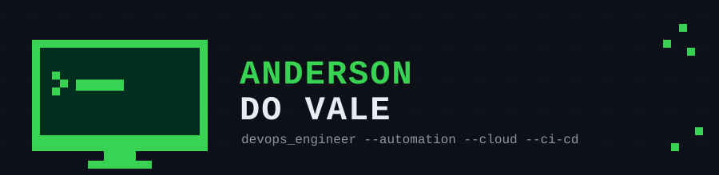

 

<i>Ajudando equipes a entregar software de forma rápida, segura e escalável através da cultura DevOps, automação e melhoria contínua.</i>

 

## ⚙️ Pilares de DevOps & Infraestrutura

<i>Automação • CI/CD • Cloud • Containers • Redes • Bancos de Dados</i>

  

 

## 💻 Ecossistema de Desenvolvimento

<i>Backend • Frontend • Mobile • APIs • Ferramentas</i>

  

 

  

